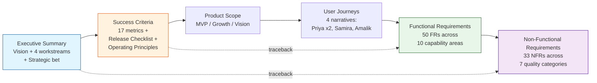

# Traceability Chain

The PRD is structured as a traceable chain from strategic vision to testable requirements. Every FR and NFR traces back to a user journey or executive-summary element; every journey traces back to a success criterion; every success criterion traces back to the vision.

**Verified by Validation Report (`convoke-report-prd-validation-bmad-v6.3-adoption.md`) Step V6:** 0 orphan FRs, 0 broken chains, 0 unsupported success criteria. The chain is intact end-to-end.

---
